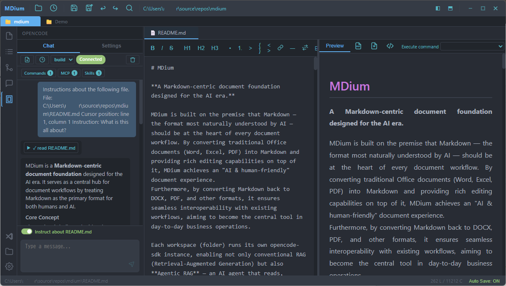
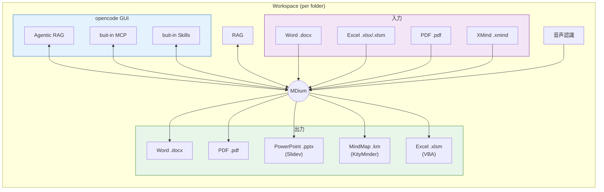

# MDium

**AI 時代のための、Markdown 中心のドキュメント基盤。**

MDium は、AI にとって最も自然なフォーマットである Markdown をあらゆるドキュメントワークフローの中心に据えるべきだという考えに基づいて構築されています。従来の Office ドキュメント（Word、Excel、PDF）を Markdown に変換し、その上にリッチな編集機能を提供することで「AI＆人間フレンドリー」を実現します。
さらに、Markdown を DOCX、PDF などのフォーマットに再変換することで既存のワークフローとのシームレスな相互運用を可能にし、日常業務の中核ツールとなることを目指しています。

各ワークスペース（フォルダ）は独自の opencode-sdk インスタンスを実行し、従来の RAG（検索拡張生成）だけでなく、**Agentic RAG** — フォルダ内のすべてのデータを読み取り、推論し、参照して、プロジェクトの知識に基づいたドキュメントを生成する AI エージェント — も可能にします。





[English README](README.md)

## 機能

### Markdown 編集

- エディタとプレビューの分割表示（リアルタイムプレビュー）
- GitHub Flavored Markdown（GFM）対応
- 数式表示（KaTeX）
- Mermaid ダイアグラム（フローチャート、シーケンス図、ER図、ガントチャート、クラス図、状態図、円グラフ）
- コードのシンタックスハイライト（18言語以上）
- クリップボードからの画像貼り付け（Ctrl+V）— プレビューダイアログ＆AI による代替テキスト自動生成
- 検索・置換（Ctrl+F / Ctrl+H）
- スクロール同期・自動保存
- ドキュメントアウトライン表示

### マルチフォーマット対応

- **Markdown**（.md）— メイン編集フォーマット
- **Office ドキュメント**（.docx, .xlsx, .xlsm）— 閲覧・変換
- **マインドマップ**（.km, .xmind）— インタラクティブなビジュアル編集
- **PDF**（.pdf）— 閲覧・Markdown への変換
- **画像**（.png, .jpg, .gif, .bmp, .svg, .webp 等）— プレビュー・キャンバス編集
- DOCX/Markdown の双方向変換
- Excel から Markdown への変換 — [xlsx2md](https://github.com/igapyon/xlsx2md) によるテーブル検出・ナラティブ抽出・画像/チャート/シェイプ・リッチテキスト対応
- Excel VBA マクロの抽出・注入（.xlsm）
- PDF エクスポート

### コードエディタ

- Monaco Editor によるコードファイルのシンタックスハイライト
- ファイル拡張子に基づく言語の自動検出

### AI 連携

- RAG（検索拡張生成）によるドキュメント Q&A
- 設定可能な埋め込みモデルによるセマンティック検索（multilingual-e5-large、Ruri v3 等）
- opencode-sdk によるコンテンツ生成（エディタへの AI テキスト挿入）
- 複数 API プロバイダー対応：OpenAI、Anthropic、DeepSeek、Azure、Gemini、Grok、Groq、Ollama、カスタムエンドポイント
- チャットセッション管理・履歴保持
- UNC パス対応（ネットワークドライブ）

### 音声入力

- Whisper ベースの音声認識（whisper-small、whisper-large-v3-turbo）
- Web Worker によるノンブロッキング処理
- エディタへの直接テキスト挿入
- モデルダウンロード（進捗表示付き）

### AI 画像生成

- ビルトイン MCP サーバー（Nano Banana 2）による Gemini ベースの AI 画像生成
- エディタ上でテキストプロンプトから画像を生成（右クリック → 挿入 → 画像 → MCP で生成）
- 生成画像は `images/` ディレクトリに自動保存され、Markdown として挿入

### マインドマップエディタ

- ReactFlow を使用したインタラクティブなノードベース編集
- テーマ・レイアウトのカスタマイズ
- ノードへのハイパーリンク・画像挿入
- KM・XMind フォーマット対応

### ファイルエクスプローラー

- ファイルツリーエクスプローラー（フォルダナビゲーション）
- マルチフォルダワークスペース（タブ対応）
- ドラッグ＆ドロップによるファイル操作（ツリー内の移動/コピー）
- OS からのファイルインポート（システムファイルマネージャーからドラッグ）
- 切り取り/コピー/貼り付け操作（Ctrl+X / Ctrl+C / Ctrl+V）
- インラインファイル名変更（F2）
- デフォルトアプリケーションで開く
- ファイルタイプ別フィルタリング（画像, .docx, .xls\*, .km/.xmind, .pdf）＋「すべて表示」モード
- ファイル監視・自動リフレッシュ
- コンテキストメニュー（名前変更、削除、コピー、切り取り、貼り付け、デフォルトアプリで開く）

### Git ソースコントロール

- 左アクティビティバーに統合された Git パネル
- リポジトリ初期化（main ブランチ）
- ファイルのステージ/アンステージ
- メッセージ入力によるコミット
- AI によるコミットメッセージ自動生成
- リモートへのプッシュ / リモート URL 管理
- ブランチ一覧・切り替え
- 変更の破棄（追跡済み・未追跡）

### 統合ターミナル

- xterm.js ベースのターミナル（PTY バックエンド）
- フォルダごとのターミナルセッション

### 開発者ツール連携

- opencode AI ツール連携（チャット、MCP サーバー設定、スキル/エージェント/ツール管理）
- Git 操作（init、add、commit、push、branch）
- MCP サーバーテスト
- Zenn 記法の Markdown レンダリング対応

### テーマ＆カスタマイズ

- 複数のビルトインテーマ（ライト/ダーク）
- フォント、カラー、レイアウトのカスタマイズ
- 外部ツールとのテーマ同期
- 日本語/英語 UI

## はじめに

### 前提条件

- [Node.js](https://nodejs.org/)（v18 以上）
- [Rust](https://www.rust-lang.org/tools/install)
- npm

### インストール

```bash
git clone https://github.com/straygizmo/mdium.git
cd mdium
npm install
```

### 開発

```bash
# Vite 開発サーバーの起動
npm run dev

# Tauri デスクトップアプリを開発モードで起動
npm run tauri dev
```

### ビルド

```bash
# プロダクションビルド
npm run build

# 配布用デスクトップアプリの作成
npm run tauri build
```

### テスト

```bash
npm run test          # テストを1回実行
npm run test:watch    # ウォッチモード
```

## キーボードショートカット

キーボードショートカットの一覧は [docs/keyboard-shortcuts.ja.md](docs/keyboard-shortcuts.ja.md) を参照してください。

## プロジェクト構成

```
mdium/
├── src/
│   ├── app/               # メインアプリ、ツールバー、タブ、ステータスバー
│   ├── features/          # 機能モジュール
│   │   ├── ai/            # AI 生成
│   │   ├── claude-config/  # Claude Code 設定
│   │   ├── editor/        # Markdown エディタ
│   │   ├── export/        # DOCX/PDF エクスポート
│   │   ├── file-tree/     # ファイルエクスプローラー＆左パネル
│   │   ├── git/           # Git ソースコントロールパネル
│   │   ├── image/         # 画像キャンバスエディタ
│   │   ├── mindmap/       # マインドマップエディタ
│   │   ├── opencode-config/ # opencode AI ツール設定
│   │   ├── preview/       # Markdown プレビュー
│   │   ├── rag/           # RAG Q&A パネル
│   │   ├── search/        # 検索/置換
│   │   ├── settings/      # 設定ダイアログ
│   │   ├── speech/        # 音声入力
│   │   ├── table/         # テーブルエディタ
│   │   ├── terminal/      # 統合ターミナル
│   │   └── zenn/          # Zenn プラットフォーム対応
│   ├── shared/            # 型定義、フック、ユーティリティ、テーマ、i18n
│   └── stores/            # Zustand ストア
├── src-tauri/             # Tauri/Rust バックエンド
│   └── src/commands/      # バックエンドコマンド（ファイル、AI、PTY、Git、RAG、音声、MCP）
├── public/                # 静的アセット・テーマファイル
└── scripts/               # ビルド・インポートスクリプト
```

## クレジット

MDium は多くの優れたオープンソースプロジェクトの上に構築されています。特に以下のプロジェクトに感謝します：

| プロジェクト | 説明 |
| ------------ | ---- |
| [opencode](https://github.com/nicepkg/opencode) | MDium のチャット、MCP サーバー、Agentic RAG 機能を支える AI コーディングツール |
| [Slidev](https://github.com/slidevjs/slidev) | Markdown から PPTX へのエクスポートに使用するプレゼンテーションエンジン |
| [open-motion](https://github.com/jsongo/open-motion) | Markdown から動画生成を実現するプログラマティックビデオエンジン |
| [Tauri](https://github.com/tauri-apps/tauri) | ネイティブシェルを提供するデスクトップアプリケーションフレームワーク |
| [React](https://github.com/facebook/react) | フロントエンド全体を支える UI ライブラリ |
| [Vite](https://github.com/vitejs/vite) | ビルドツール・開発サーバー |
| [Monaco Editor](https://github.com/microsoft/monaco-editor) | ソースファイル編集用コードエディタコンポーネント |
| [ReactFlow](https://github.com/xyflow/xyflow) | マインドマップエディタ用のノードベースグラフライブラリ |
| [KityMinder](https://github.com/nicepkg/kityminder) | マインドマップフォーマット（.km）のサポート |
| [xlsx2md](https://github.com/igapyon/xlsx2md) | テーブル検出・リッチテキスト抽出対応の Excel→Markdown コンバーター |
| [marked](https://github.com/markedjs/marked) / [remark](https://github.com/remarkjs/remark) | Markdown のパースと変換 |
| [KaTeX](https://github.com/KaTeX/KaTeX) | 数式レンダリング |
| [Mermaid](https://github.com/mermaid-js/mermaid) | テキスト定義からの図表・チャートレンダリング |
| [Fabric.js](https://github.com/fabricjs/fabric.js) | 画像エディタ用 HTML5 キャンバスライブラリ |
| [xterm.js](https://github.com/xtermjs/xterm.js) | 統合ターミナル用のターミナルエミュレータ |
| [Hugging Face Transformers.js](https://github.com/huggingface/transformers.js) | 音声認識・埋め込みモデル用の ML 推論 |
| [Tesseract.js](https://github.com/naptha/tesseract.js) | 画像テキスト認識用 OCR エンジン |
| [Zustand](https://github.com/pmndrs/zustand) | 軽量な状態管理 |
| [mammoth](https://github.com/mwilliamson/mammoth.js) / [docx](https://github.com/dolanmiu/docx) | Word ドキュメントの読み書き |
| [highlight.js](https://github.com/highlightjs/highlight.js) | コードブロックのシンタックスハイライト |

…その他 `package.json` および `Cargo.toml` に記載されているすべてのライブラリに感謝します。

## ライセンス

[MIT](LICENSE) - Copyright (c) 2025 straygizmo
